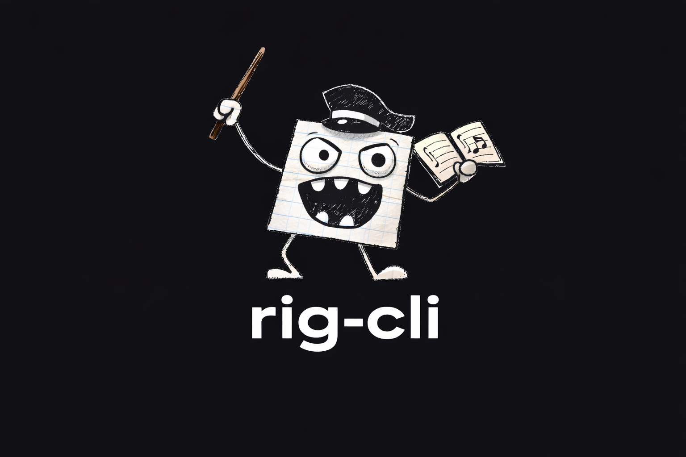

# rig-cli



AI-assisted GitHub issue creation and PR opening. rig handles the chores around your code: it turns plans into well-formed GitHub issues, and finished branches into well-formed pull requests. You implement with whatever coding tool you prefer.

A side benefit: every change follows a traceable path from issue to branch to pull request. That paper trail doubles as change-management evidence for compliance frameworks like SOC 2.

---

## Workflow

```
rig create-issue  →  implement with your own tools  →  rig pr
```

1. **`rig create-issue`** — paste a plan in plain text. AI structures it into a GitHub issue with title, body, and labels.
2. **Implement** — pick up the issue with your editor, Claude Code, Cursor, or anything else. Name the branch `issue-42-short-slug`.
3. **`rig pr`** — pushes the branch, generates a PR body from the issue and commits, and opens (or updates) the PR.

For a full spec or PRD, use **`rig story`** instead of `create-issue`. It creates one parent story issue plus a set of small, independently implementable child issues.

---

## Install

**Requirements:** Node.js 20+, [GitHub CLI](https://cli.github.com/) (`gh`), Git. For AI calls: a `GROQ_API_KEY` (create one at [console.groq.com](https://console.groq.com)).

```bash
npm install -g rig-cli
```

---

## Commands

### `rig create-issue`

Describe an issue in plain text. AI structures it into a proper GitHub issue with title, body, and labels, shows a preview, and files it after you confirm. For non-interactive use (scripts, coding agents), pass `--file` and `--yes`.

```bash
rig create-issue
rig create-issue --file issue.md --yes
```

### `rig story`

Paste a planning spec or PRD. AI creates a parent story issue plus atomic child issues, each sized for one branch and one PR. You confirm before each step. For non-interactive use, pass `--file` and `--yes`.

```bash
rig story
rig story --file spec.md --yes
```

### `rig grab`

Copy an issue's title and body to the clipboard, ready to paste into your coding tool (Claude Code, Cursor, etc.). With no argument, lists open issues and prompts you to pick one. Prints the issue instead if no clipboard is available.

```bash
rig grab 42
rig grab      # pick from open issues
```

### `rig branch`

Create a working branch for an issue off the latest base branch (fetched from origin when available), then push it to origin with upstream tracking. Branches follow `<type>/issue-<n>-<slug>` in lowercase kebab-case: the type comes from the issue's type label (`bug` → `fix`, `feature` → `feat`, etc.), and the slug is written by the AI from the issue content (falls back to a title-derived slug). If a branch for the issue already exists, switches to it instead.

```
fix/issue-21-handle-empty-clipboard
feat/issue-34-add-issue-picker
```

```bash
rig branch 21
```

### `rig pr`

Create or update a pull request for the current branch. The linked issue comes from `--issue`, or from the branch name (`issue-42-slug`, `42-slug`, or `feat/42-slug`). The PR body is generated from the issue and commit history.

Date-like branch names (`2025-08-cleanup`, `8-15-hotfix`) are not treated as issue numbers — pass `--issue` for those. The command refuses to run on `main`, `master`, or the configured base branch.

```bash
rig pr
rig pr --issue 42
```

### `rig setup-labels`

Create rig's label set on the GitHub repo. Safe to run more than once.

```bash
rig setup-labels
```

---

## Configuration

Create `.rig.yml` in your project root. All fields are optional; missing values use defaults.

```yaml
agent:
  provider: groq     # Groq API (default)
  model: openai/gpt-oss-120b  # model ID to request (default: provider-specific)
  timeout: 120       # seconds per AI call

git:
  base_branch: main  # auto-detected if omitted (main or master)

defaultLabels: []    # labels added to every created issue

# Optional: a markdown style guide injected into every AI prompt, so
# generated issues follow your writing rules. Relative to the project
# root; ~/ expands to your home directory.
style_file: ~/style/writing-rules.md

verbose: false
```

---

## Claude Code skill

The repo ships an agent-facing skill at [`.claude/skills/rig/SKILL.md`](./.claude/skills/rig/SKILL.md) that teaches Claude Code the rig workflow: which commands to run for "pick up issue 22" or "open a PR", and which flags (`--file`, `--yes`) keep the interactive commands from hanging under an agent. Copy the `rig` folder into your own project's `.claude/skills/` directory to use it there.

---

## AI Providers

**Groq** (default): Groq's hosted open models over the OpenAI-compatible chat-completions API. Requires `GROQ_API_KEY`. Defaults to `openai/gpt-oss-120b`; override with `agent.model` in `.rig.yml`.

Providers are small subclasses of `OpenAICompatProvider` (`src/services/llm-provider.ts`) — adding another vendor is a name, base URL, API-key env var, and default model.

AI is used only for text generation — issue bodies and spec decomposition. rig never runs an agent on your code.

---

## Disclaimer

rig-cli is an unofficial third-party tool created by Zach Stecko. Not affiliated with or endorsed by Groq. You must have your own API key and comply with your model provider's terms of service.

## License

MIT
